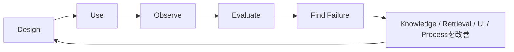

## 導入を完成にしない

問い合わせの内容、対象製品、Knowledge、利用者の入力は変化します。PoC時点で回答できたからといって、同じ品質が続くとは限りません。

運用では、正解率や自己解決率だけでなく、どの段階で利用者が止まり、なぜ人間へ移行し、どのKnowledgeが不足していたかを確認します。

## 観測するもの

| 観測対象 | 改善先の例 |
|---|---|
| 誤った回答・根拠逸脱 | 回答条件、Prompt、受入判定 |
| 有人対応へ移った問い合わせ | 対象範囲、停止条件、業務分担 |
| 適合する文書を取得できない | Knowledge追加、機種・版の対応付け、検索条件 |
| 追加質問が長い・離脱する | 質問順序、表現、UI、入力支援 |
| 同じ確認を人間が繰り返す | Handoff情報、担当者画面、要約 |
| 新機種・版更新 | 文書の有効期間、回帰評価データ |

## 失敗を分類して改善する

回答できなかった問い合わせを、すぐKnowledge不足と決めつけません。原因は次のように分けられます。

- 必要な文書が存在しない
- 文書はあるが機種・版・公開属性が不足している
- 検索条件や分類が適切でない
- 追加質問で必要なContextを得られていない
- 回答生成が根拠を正しく利用していない
- そもそも人間が扱うべき問い合わせである

原因によって、改善先はKnowledge、Retrieval、Dialogue、UI、業務プロセスへ分かれます。モデル変更だけで直そうとすると、失敗の所在が見えなくなります。

## 同じ条件で再評価する

改善後は、失敗した問い合わせを評価データへ加え、同じ条件で再実行します。自己解決範囲を広げる場合も、既存の安全な回答が壊れていないかを回帰評価します。

Design、Use、Observe、Evaluate、Improveを循環させることで、QAシステムを導入プロジェクトから継続的な業務改善へ変えます。これは[Lifecycle / Operations](/ai-design-foundations/ai-design/lifecycle-operations/)で扱う設計思想と同じです。

