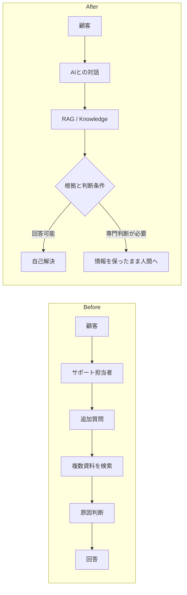

## Executive Summary

題材は、複合機・プリンタ関連製品について、操作方法、設定、製品トラブルを扱う顧客サポートです。統合元資料では、問い合わせの受付から状況確認、追加質問、資料検索、原因判断、回答まで、すべてにサポート担当者が介在する業務を前提としています。

このケースで目指したのは、検索だけを速くすることではありません。既存文書を根拠に安全に回答できる問い合わせは顧客の自己解決へ移し、専門判断や個別調査が必要な問い合わせへ人間を集中させることです。

## 何を設計したケースか

| 領域 | 設計対象 |
|---|---|
| DX / 業務設計 | 全件有人から、自己解決と専門対応を分ける業務構造への変更 |
| Applied AI | 自然言語理解、追加質問、根拠検索、回答生成の適用範囲 |
| RAG / Knowledge | 機種、版数、公開可否、問い合わせ分類による検索制御 |
| Responsibility / HITL | AIの停止条件と、人間が保持する判断責任 |
| UX / UI | 内部分類を知らなくても質問でき、確認を一つずつ進められる対話 |
| Evaluation / PoC | 検索、対話、回答生成、業務成立性を分けた評価 |
| Operations | 誤回答、有人移行、文書不足、離脱を改善へ戻す仕組み |

## この事例で示す判断

生成AIが回答文を作れることと、顧客へ回答してよいことは同じではありません。回答には、対象に適合し、現在有効で、顧客へ公開できる根拠が必要です。条件を満たさない場合は、AIの推測で埋めず、人間へ引き継ぎます。

本書で扱う能力は、RAGの実装だけではありません。価値と業務課題からAIの役割を決め、技術的に動くか、業務として成立するか、導入後に改善できるかを一続きで設計することです。

## 事実性の範囲

本書は、同じQAシステムを異なる設計観点から整理した複数資料を統合しています。資料には実務上の観察に加えて、資格試験の論述として再構成した数値、PoC条件、効果試算が含まれます。そのため、数値は[09. 何が変わったのか](/Rosarium/cases/customer-support-ai-dx/outcomes-and-evidence/)で位置づけを分け、公開実績としては扱いません。

