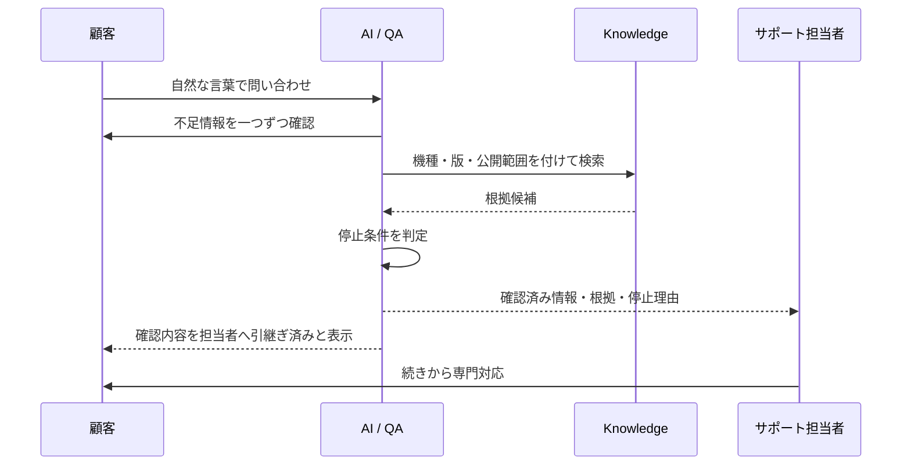

## 「分からなければ人間へ」だけでは足りない

AIが回答できないときに有人窓口を案内するだけでは、顧客は問い合わせを最初から説明し直すことになります。担当者も長い会話履歴を読み直し、どこまで確認済みかを探さなければなりません。

この状態では、AIとの対話がそのまま追加負担になります。HITLを成立させるには、対応の主体だけでなく、途中まで集めたContextを引き継ぐ必要があります。

## 引き継ぐ情報

- 会話履歴
- 対象機種と版
- 接続方法、OSなどの利用環境
- エラー表示と症状
- 利用者が実施済みの対処
- 確認済み事項と未確認事項
- 検索結果と参照した文書
- AIを停止した理由

## 担当者向け画面

長い対話をそのまま表示するだけでなく、「確認済み情報」と「追加確認が必要な情報」を分けます。対象機種、接続方法、エラー、実施済みの対処、参照文書を一覧できれば、担当者は判断を再開する位置を把握できます。

AIの要約だけに依存せず、元の会話と参照文書へ戻れることも必要です。要約は入口であり、判断根拠そのものではありません。

## 顧客側の体験

顧客側にも「これまでに確認した内容を担当者へ引き継ぎました」と示します。引継ぎが見えなければ、同じ説明を求められる不安が残るからです。

AIから人間への移行は、自己解決できなかった後の退避先ではありません。低リスクな自己解決と専門対応を一つのサービスとして接続する、主要なWorkflowです。

