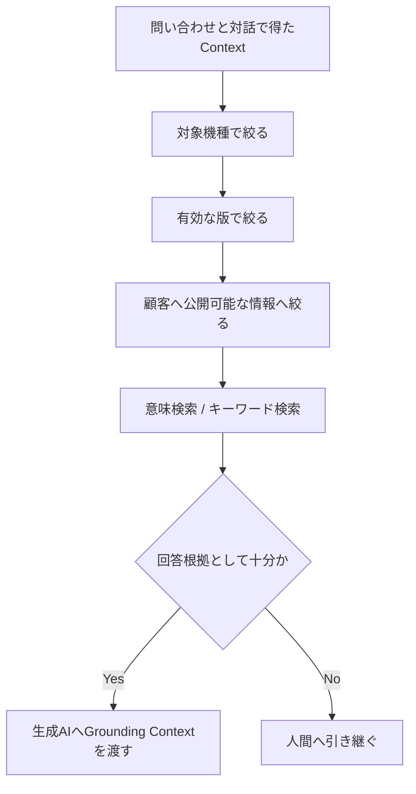

## Semantic Similarityは回答資格ではない

RAGで問い合わせに似た文書を検索できても、その文書を回答根拠として使ってよいとは限りません。類似機種の障害情報、古い版の手順、調査中の内部情報は、意味的には近くても顧客への回答には不適切です。

```text
Semantic Similarity ≠ Business Validity
```

そこで検索を「似ている文書を探す処理」だけで終わらせず、業務上利用できるKnowledgeへ絞り込む処理として設計します。

## 横断検索の前に揃えるもの

情報は、文書管理、問題管理、問い合わせ管理など複数の既存システムへ分散しています。各システムが異なる機種名や分類を使っていると、検索対象を安全に限定できません。

このケースでは、次の属性を共通化する考え方を採ります。

| 属性 | 制御する理由 |
|---|---|
| 対象機種 | 類似する別機種の情報を回答へ混ぜない |
| 版数・有効期間 | 現在の画面や設定手順と異なる旧版を除外する |
| 公開可否 | 開発中・調査中・社内限定の情報を顧客へ出さない |
| 問い合わせ分類 | 操作、設定、障害など、検索対象と判断基準を切り替える |
| Provenance | 情報源と確認状態を追跡できるようにする |

## Retrievalを段階化する



メタデータによる絞込みは、Vector Searchの結果を補う後処理ではありません。検索してよい母集団を先に決めるGuardrailです。その上で意味検索やキーワード検索を使います。

## Knowledgeを運用対象にする

文書を登録して終わりにはしません。新機種、版更新、公開状態の変更、FAQの追加、障害情報の確定に合わせて、属性と検索条件を更新する必要があります。

また、検索に失敗した問い合わせを記録すれば、文書が存在しないのか、分類が誤っているのか、機種の対応付けが不足しているのかを切り分けられます。RAGの品質はモデルだけでなく、Knowledgeの状態と運用で決まります。

この責務分離は、[Instruction・Knowledge・Evidence](/ai-design-foundations/knowledge-context/instruction-knowledge-evidence/)と[Knowledge / Context設計](/ai-design-foundations/ai-design/knowledge-context/)で詳しく扱っています。

