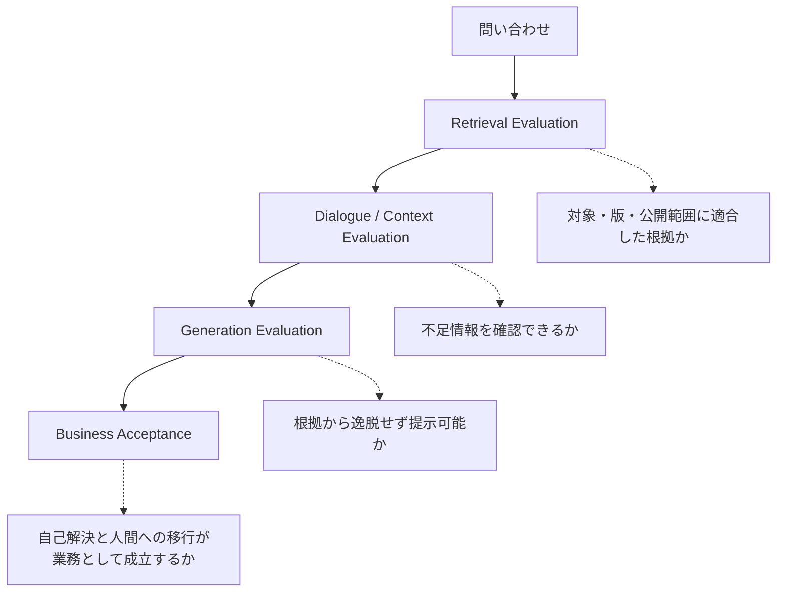

## 「動いた」だけでは採用できない

生成AIが自然な回答を返した、関連しそうな文書を検索できた、というデモだけでは業務への導入可否を判断できません。正しそうに見える回答でも、別機種の文書を根拠にしていれば顧客へ提示できないからです。

このケースでは、PoCの評価をRetrieval、Generation、Business Acceptanceへ分けて設計します。対話はGenerationの前提となるContext収集として独立に観測します。

## 1. Retrieval

問い合わせと意味的に近いかだけでなく、対象機種、版、問い合わせ分類、顧客への公開可否が一致しているかを確認します。ここで誤った文書を取得すれば、後段の回答生成が流暢でも失敗です。

評価記録には、検索語だけでなく、機種・版・公開可否のFilter、取得候補、順位、除外理由、最終的に回答根拠へ採用した文書を残します。これにより「回答が誤った」事象を、根拠を取得できなかった問題と、取得した根拠を誤用した問題へ分けられます。

## 2. Dialogue / Context

原因特定に必要な情報が不足しているとき、適切な追加質問を生成できるかを確認します。質問の順序、利用者が理解できる表現、すでに得た情報を聞き直さないことも評価対象です。

すべての不足情報を質問するのではなく、次の検索範囲または停止判定が変わる情報を優先します。例えば機種の特定で検索母集団が変わるなら先に確認し、回答可否に影響しない属性は質問しません。質問数を増やすことは精度向上ではなく、離脱という業務上の失敗を増やす可能性があります。

## 3. Generation

必要情報がそろった後、回答が根拠文書から逸脱していないか、顧客へ提示できる表現か、人間による修正を必要とするかを確認します。

「正解文と似ているか」だけではなく、使用した根拠が明示され、根拠にない条件や操作を付け足していないことを確認します。回答が正しくても、別機種の根拠、期限切れの手順、非公開情報を利用していれば不合格です。

## 4. Business Acceptance

三段階をすべて満たす問い合わせだけを、自己解決候補として扱います。加えて、対象外の問い合わせを人間へ安全に戻せること、引継ぎで情報が失われないこと、改善に必要なログを取得できることも必要です。

| 判定 | Retrieval | Generation | 業務上の扱い |
|---|---|---|---|
| 自己解決候補 | 対象・版・公開範囲が適合 | 根拠範囲内で回答し、引用を追跡できる | 顧客へ提示可能かを業務基準で受入判定する |
| 担当者支援 | 根拠候補はある | 専門判断または補足が必要 | 根拠とContextを人間へ渡し、AIは確定しない |
| 停止 | 根拠なし、矛盾、対象外 | 生成を続けない | 停止理由を付けて有人対応へ移す |

PoCで採用しないのは、全件を一つの正答率へ集約する評価です。高頻度の簡単な問い合わせで平均値が上がっても、高影響の誤案内や停止漏れを隠すためです。対象区分、失敗種別、提示可否を分けて記録し、採用範囲を問い合わせ種別ごとに決めます。

資料では、過去問い合わせから500件を抽出する評価モデルと、自動回答範囲に関する複数の比率が示されています。ただし、それらは論述資料間で母数と位置づけが一致しません。本書ではPoCの設計方法を採用し、数値を公開実績とは扱いません。数値の整理は[09. 何が変わったのか](/Rosarium/cases/customer-support-ai-dx/outcomes-and-evidence/)にまとめます。

評価を分解することで、失敗がRetrieval、Dialogue、Answerのどこにあるかを特定できます。この考え方は、[AI Evaluation](/Rosarium/ai-design/evaluation-hitl/)へ接続します。

