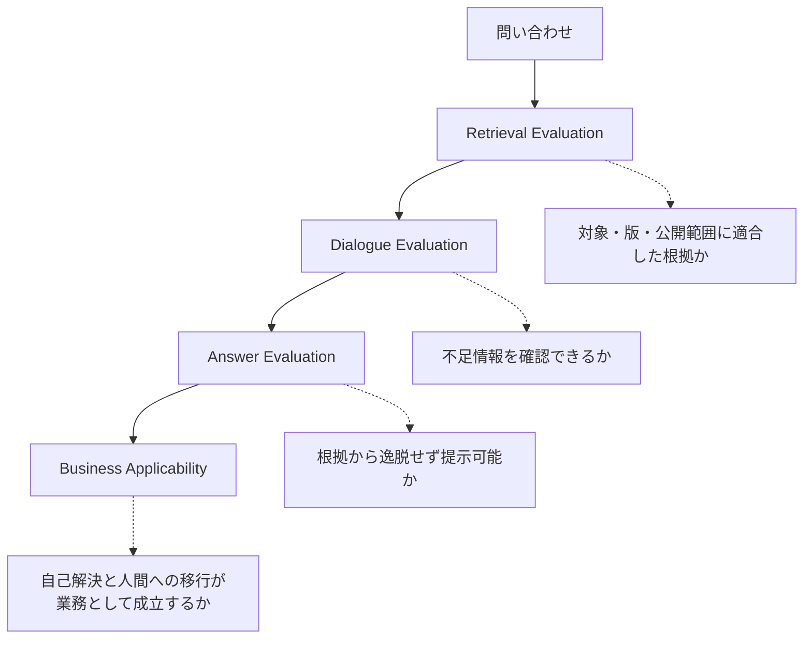

## 「動いた」だけでは採用できない

生成AIが自然な回答を返した、関連しそうな文書を検索できた、というデモだけでは業務への導入可否を判断できません。正しそうに見える回答でも、別機種の文書を根拠にしていれば顧客へ提示できないからです。

このケースでは、PoCの評価を三つに分けて設計します。

## 1. 文書検索

問い合わせと意味的に近いかだけでなく、対象機種、版、問い合わせ分類、顧客への公開可否が一致しているかを確認します。ここで誤った文書を取得すれば、後段の回答生成が流暢でも失敗です。

## 2. 対話

原因特定に必要な情報が不足しているとき、適切な追加質問を生成できるかを確認します。質問の順序、利用者が理解できる表現、すでに得た情報を聞き直さないことも評価対象です。

## 3. 回答生成

必要情報がそろった後、回答が根拠文書から逸脱していないか、顧客へ提示できる表現か、人間による修正を必要とするかを確認します。

## 業務成立性を受入条件にする

三段階をすべて満たす問い合わせだけを、自己解決候補として扱います。加えて、対象外の問い合わせを人間へ安全に戻せること、引継ぎで情報が失われないこと、改善に必要なログを取得できることも必要です。

資料では、過去問い合わせから500件を抽出する評価モデルと、自動回答範囲に関する複数の比率が示されています。ただし、それらは論述資料間で母数と位置づけが一致しません。本書ではPoCの設計方法を採用し、数値を公開実績とは扱いません。数値の整理は[09. 何が変わったのか](/ai-design-foundations/cases/customer-support-ai-dx/outcomes-and-evidence/)にまとめます。

評価を分解することで、失敗がRetrieval、Dialogue、Answerのどこにあるかを特定できます。この考え方は、[AI Evaluation](/ai-design-foundations/ai-design/evaluation-hitl/)へ接続します。

