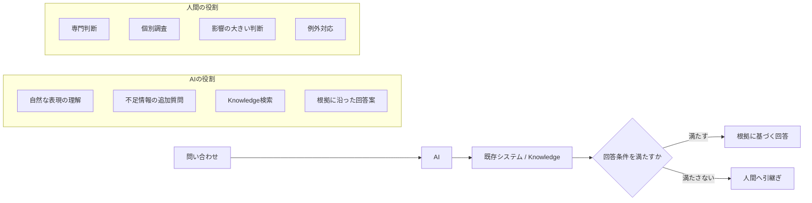

## 問い合わせを一律に自動化しない

同じ顧客サポートでも、問い合わせの性質は異なります。資料では、過去の問い合わせを次の三つに分けて考えています。

1. 既存文書に回答根拠があり、確認事項も比較的定型的である
2. 既存文書に根拠はあるが、症状の切分けや専門判断が必要である
3. 個別調査や開発部門への確認が必要である

AIの主な対象は1です。2と3まで自動化率を上げるためにAIへ任せると、根拠の弱い回答や、影響を判断できない案内が増えます。自動化率ではなく、責任を持って回答できる範囲を先に決めます。

## Responsibility Boundary

| 担当 | 保持する役割 |
|---|---|
| AI | 自然な問い合わせの解釈、不足情報の確認、検索要求の構成、根拠に沿った回答案 |
| 人間 | 専門判断、個別調査、高影響の操作、例外の処理、最終的な責任 |
| 既存システム / Knowledge | マニュアル、仕様、FAQ、確認済み障害情報、機種・版・公開可否などの事実と制約 |

## 委任レベルを変える

回答根拠と確認事項が明確な問い合わせでは、AIへ対話から回答まで委任できます。専門判断が必要なら、AIは情報収集と候補提示までに留めます。個別調査が必要なら、入口で必要情報を集め、人間へ渡す支援に限定します。

同じシステムの中でも、問い合わせのリスクと不確実性に応じて委任レベルを変える設計です。これは「AIを使うか、使わないか」の二択ではありません。どこまで任せ、どこから人間が受理するかを決めることです。

詳しい原則は、[AIと人間の責任境界](/ai-design-foundations/ai-design/responsibility-control/)で扱っています。

