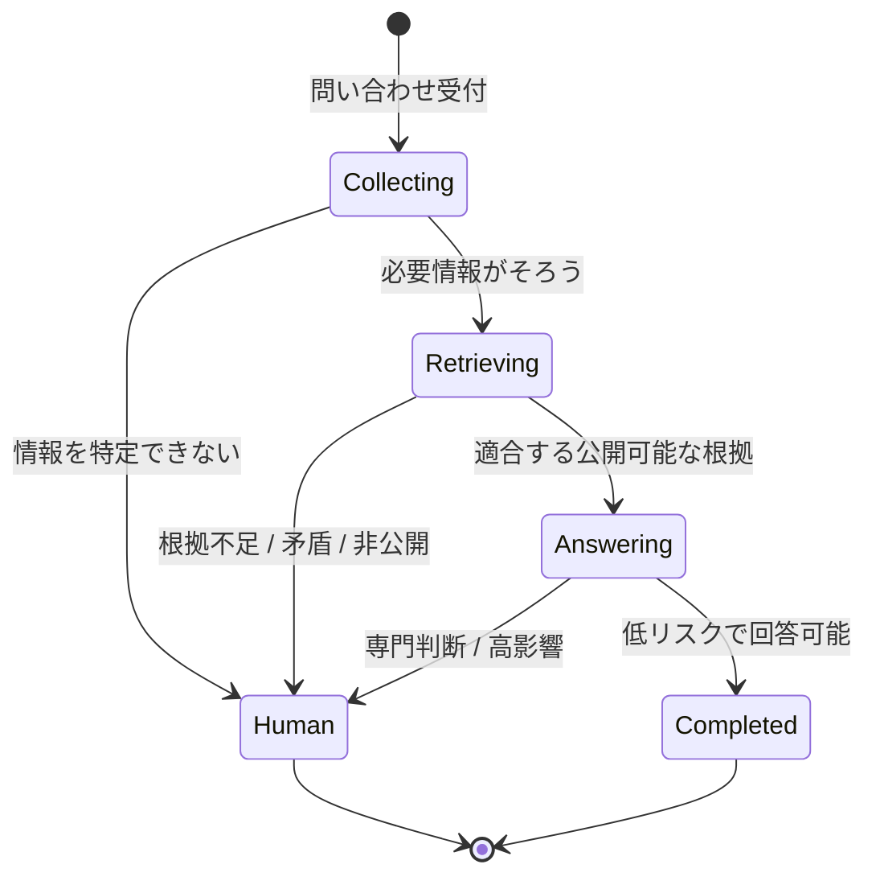

## 回答できそうかではなく、回答してよいか

生成AIは、根拠が不足していても自然な回答を組み立てられます。顧客向けQAでは、その能力を回答条件にしてはいけません。

回答の可否は、生成AI自身の自信ではなく、システム側で確認できる条件から決めます。条件を満たさない場合は、回答文を工夫して続行するのではなく停止します。

## 停止条件

このケースでは、少なくとも次の場合を人間への移行条件として扱います。

- 対象機種と版に適合する根拠を取得できない
- 追加質問を行っても原因を絞り込めない
- 症状の切分けや個別調査など、専門判断が必要である
- 設定変更、データ消失、安全性などへの影響が大きい
- 顧客へ公開できない情報しか見つからない
- 複数の根拠が矛盾し、どれを採用するか決められない

## Fail SafeとしてのHITL

Human in the Loopは、AIの回答を毎回人が承認することだけを意味しません。低リスクで条件を満たす問い合わせは自己解決へ進め、境界を越えるものだけを人間へ戻す設計もHITLです。

重要なのは、人間へ戻すことが例外処理として後付けされていないことです。停止条件、引継ぐ情報、人間が判断を再開する位置を、通常のWorkflowとして定義します。

停止は失敗ではありません。誤った回答を避け、専門性を必要な場所へ集中させるための正常な結果です。詳しい状態設計は、[責任境界と状態遷移](/ai-design-foundations/reference/responsibility-state-model/)を参照してください。

