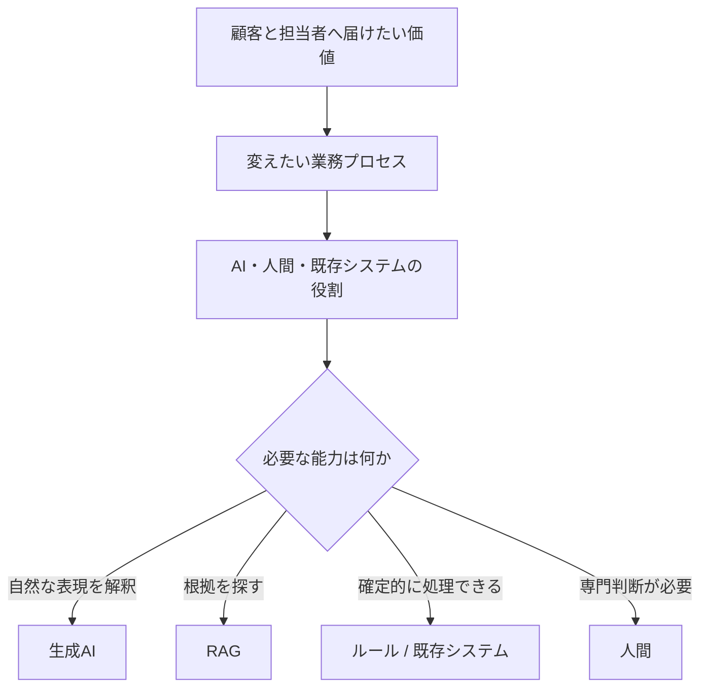

## 技術ではなく、変えたい業務から始める

顧客から届く問い合わせには、「印刷しても紙が出ない」のように、症状だけでは原因を判断できないものがあります。担当者は対象機種、接続方法、OS、エラー表示などを確認し、回答に応じて次の質問を変えながら、マニュアル、仕様書、FAQ、障害情報を探します。

既存の検索支援を改善すれば、担当者が資料を見つける時間は短くできます。しかし、すべての問い合わせに担当者が入り、確認、検索、判断、回答を行う構造は残ります。局所的な検索時間を短縮しても、顧客が回答を待つことや、人間が定型的な問い合わせにも介在することは変わりません。

## 提供したい価値

このケースで先に置いた価値は、次の二つです。

- 顧客が、専門用語や内部分類を知らなくても、回答可能な問い合わせを自分で解決できる
- サポート担当者が、症状の切分け、個別調査、影響の大きい判断など、人間の専門性が必要な仕事へ集中できる

そのため、出発点は「RAGを導入する」ではなく、問い合わせを性質によって分け、業務の流れを変えることになります。

## なぜ生成AIとRAGだったのか

固定フォームやルールベースの分岐だけでは、利用者が分類や入力項目を理解していることを前提にしやすくなります。生成AIは、利用者の自然な表現を受け取り、不足情報を対話で確認する部分に適しています。

一方、生成AIの内部知識だけで製品固有の回答を確定することはできません。回答根拠は、既存システムが保持するマニュアル、仕様書、FAQ、確認済みの障害情報から取得する必要があります。そこでRAGを組み合わせます。

生成AIとRAGは目的ではなく、業務変化を実現するために選ぶ手段です。AIを使わなくても安全かつ十分に価値を出せる処理は、ルールや既存機能へ残します。この順序は、Rosariumの[AI適用判断](/ai-design-foundations/ai-design/applicability/)と同じです。

