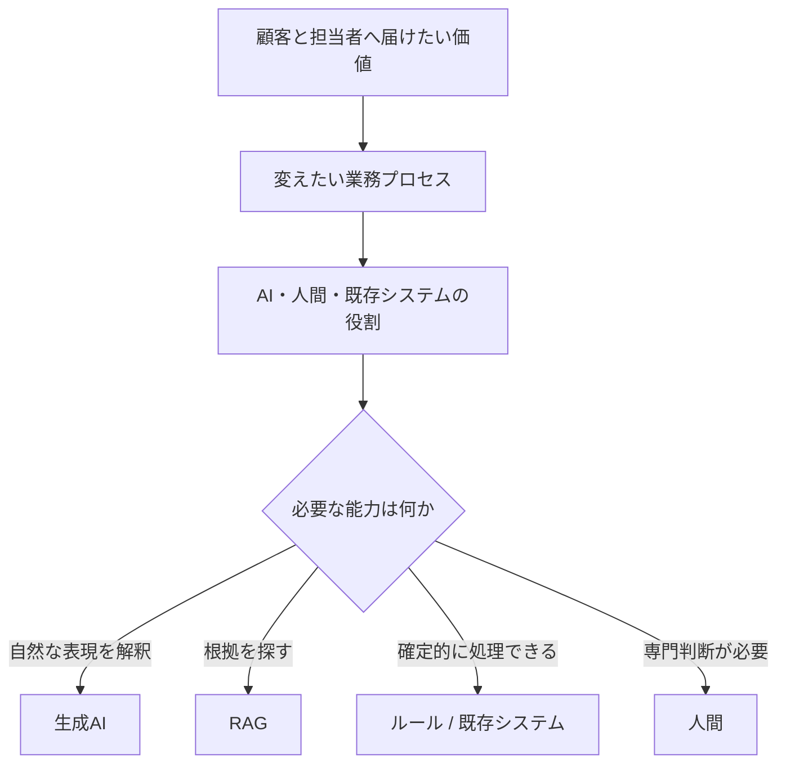

## 技術ではなく、変えたい業務から始める

顧客から届く問い合わせには、「印刷しても紙が出ない」のように、症状だけでは原因を判断できないものがあります。担当者は対象機種、接続方法、OS、エラー表示などを確認し、回答に応じて次の質問を変えながら、マニュアル、仕様書、FAQ、障害情報を探します。

既存の検索支援を改善すれば、担当者が資料を見つける時間は短くできます。しかし、すべての問い合わせに担当者が入り、確認、検索、判断、回答を行う構造は残ります。局所的な検索時間を短縮しても、顧客が回答を待つことや、人間が定型的な問い合わせにも介在することは変わりません。

## 提供したい価値

このケースで先に置いた価値は、次の二つです。

- 顧客が、専門用語や内部分類を知らなくても、回答可能な問い合わせを自分で解決できる
- サポート担当者が、症状の切分け、個別調査、影響の大きい判断など、人間の専門性が必要な仕事へ集中できる

そのため、出発点は「RAGを導入する」ではなく、問い合わせを性質によって分け、業務の流れを変えることになります。

## AI以外の選択肢も比較する

この業務課題に対して、生成AIだけが選択肢だったわけではありません。比較すべきなのは技術名ではなく、顧客が解決へ進むまでに何が残るかです。

| 選択肢 | 改善できること | 残る課題 | このケースでの位置づけ |
|---|---|---|---|
| FAQの整理 | 既知の質問へ短く回答できる | 利用者が適切なFAQを選ぶ必要があり、症状からの切分けは残る | 回答可能範囲のKnowledgeとして活用する |
| 検索機能の改善 | 担当者が資料を探す時間を短縮できる | 受付、追加質問、判断、回答は有人のまま残る | 担当者支援には有効だが、自己解決だけでは不十分 |
| 固定フォームとルール | 対象が限定されれば再現可能に処理できる | 分岐が増えるほど保守が難しく、利用者に分類知識を求めやすい | 機種選択や高影響操作など、確定的な処理へ使う |
| 既存システムの全面改修 | 情報と処理を統合できる可能性がある | 改修範囲が大きく、自然な問い合わせの解釈や文書横断は別途必要 | AI導入の前提とはせず、必要なAPI・状態参照だけを接続する |
| 生成AI + RAG + 有人移行 | 自然な表現から不足情報を集め、根拠を用いて回答か引継ぎへ進める | Knowledge統制、停止条件、評価、運用が必要 | 自己解決と専門対応を一つの流れへつなぐ案として採用する |

採用理由は、生成AIが流暢だからではありません。問い合わせの入口で顧客へ内部分類を要求せず、確認済み情報を保持したまま、回答と有人対応のどちらにも進める点にあります。

反対に、機種番号の照合、契約状態、権限、受付番号、処理結果の確定は生成AIへ任せません。既存システムやルールで確定できる処理をAIへ置き換えても、不確実性と運用負荷を増やすだけだからです。

## なぜ生成AIとRAGだったのか

固定フォームやルールベースの分岐だけでは、利用者が分類や入力項目を理解していることを前提にしやすくなります。生成AIは、利用者の自然な表現を受け取り、不足情報を対話で確認する部分に適しています。

一方、生成AIの内部知識だけで製品固有の回答を確定することはできません。回答根拠は、既存システムが保持するマニュアル、仕様書、FAQ、確認済みの障害情報から取得する必要があります。そこでRAGを組み合わせます。

生成AIとRAGは目的ではなく、業務変化を実現するために選ぶ手段です。AIを使わなくても安全かつ十分に価値を出せる処理は、ルールや既存機能へ残します。この順序は、Rosariumの[AI適用判断](/Rosarium/ai-design/applicability/)と同じです。

次章では、この比較を「AIに任せる処理」「既存システムが確定する処理」「人間が責任を持つ判断」へ分解します。

